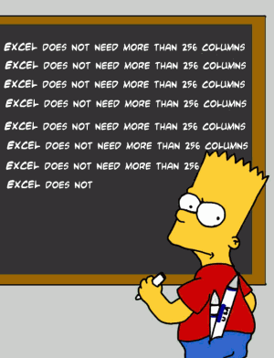
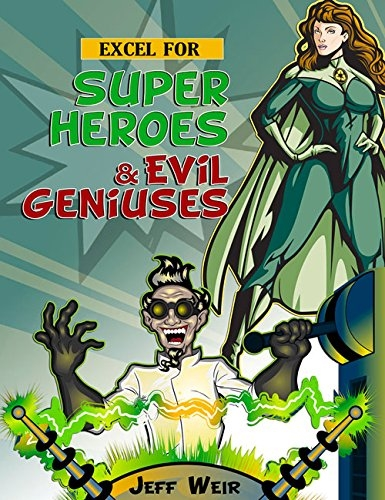
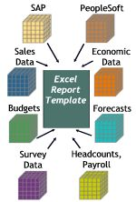
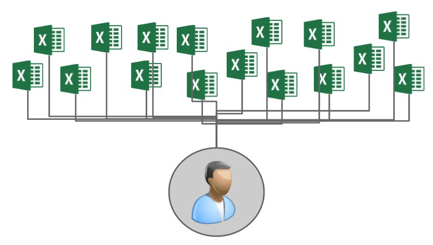
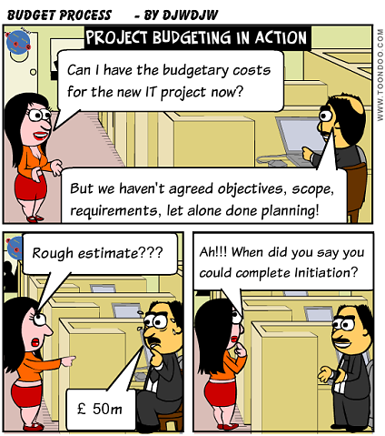
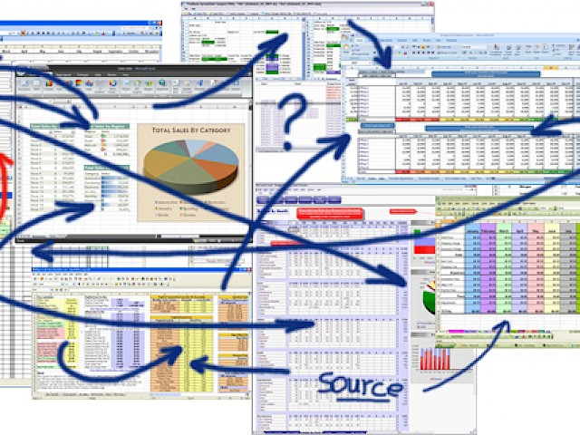

<!-- nathan@logdata.tech -->

# Spreadsheet Hell

60% of large companies feel 'Spreadsheet Hell' describes their reliance on spreadsheets
either completely or fairly well. The same survey noted spreadsheet use at 100% of all
respondents, the only universal technology.

It is pretty hard to overstate the importance of spreadsheets to modern business life.

The City of London to be heavily dependent, with most respondents suggesting that spreadsheets were critical to the ongoing viability of the markets and by extension of the City itself.

So we have a completely business critical resource, perhaps like the corporate network or
email, and yet in general there appears to be no identifiable person or body responsible
for managing it. In many organisations the responsibility falls through the gap between
the IT department and the business users. Or it did, Sarbanes Oxley raised the profile of
what was once every organisations dirty little secret.

[How Many Excel Documents Do You Have](./ExcelFilesBreed.md)

[Microsoft's Excel Might Be The Most Dangerous Software On The Planet](./ExcelMightBeTheMostDangerousSoftware.md)

[Managing spreadsheet risk](./ManagingSpreadsheetRisk.md)

[Ways To Prevent Errors In Your Spreadsheets](./NineWaysToAvoidExcelErrors.md)

[Sorry, Your Spreadsheet Has Errors (Almost 90% Do)](./SorryYourSpreadsheetHasErrors.md)

[Spreadsheet Blunders costing business billions](./SpreadsheetBlunders.md)

[Top Disadvantages of Spreadsheets](./TopDisadvantagesOfSpreadsheets.md)

[Woolworths leaks one million of gift cards in massive data breach debacle](./WooliesMillionDollarOopsie.md)

## Lighter Side

[Spreadsheet Humour](./SpreadsheetHumour.md)

[Quotes on Spreadsheets](./QuotesOnSpreadsheets.md)

## Some More Images

