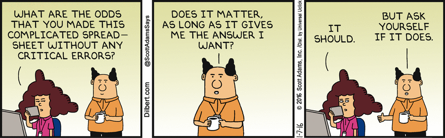
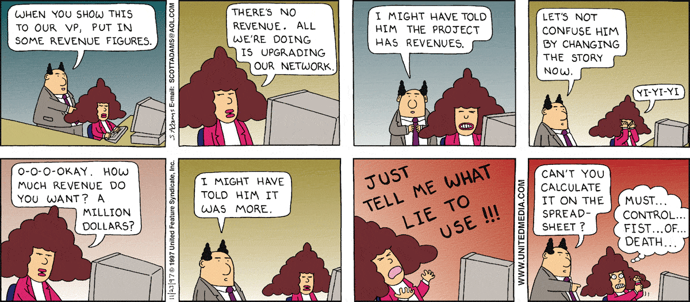
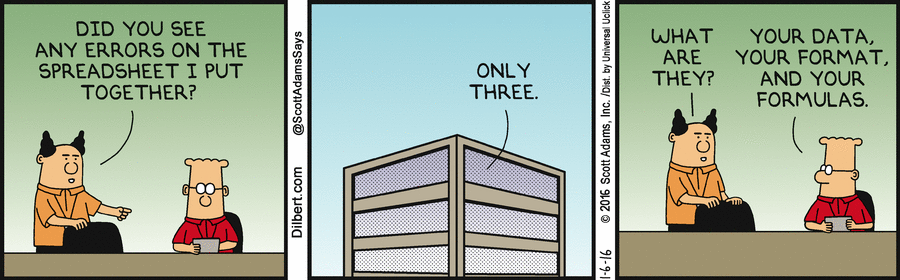

# Spreadsheet Humour

<!-- http://www.eusprig.org/humour.htm -->

## Dilbert Strips

[Does it matter if the spreadsheet is wrong ? - 2016-01-07](http://dilbert.com/strip/2016-01-07)

[Only Three Spreadsheet Errors - 2016-01-06](http://dilbert.com/strip/2016-01-06)

[Double Revenue by Increasing Absenteeism - 2011-06-02](http://dilbert.com/strips/comic/2011-06-02/)

[Spreadsheets Don’t Lie, But Neither does Bat Excrement - 2009-05-22](http://dilbert.com/strips/comic/2009-05-22/)

[MBAs and Spreadsheets - 2009-05-21](http://dilbert.com/strips/comic/2009-05-21/)

[C23 in a Bad Mood - 2007-08-09](http://dilbert.com/strips/comic/2007-08-09/)

[Numbers Don’t Lie - 2007-08-08](http://dilbert.com/strips/comic/2007-08-08/)

[Manage by Spreadsheet - 2007-08-07](http://dilbert.com/strips/comic/2007-08-07/)

[Go Track Yourself - 2007-03-20](http://dilbert.com/strips/comic/2007-03-20/)

[Check my Spreadsheet - 2004-12-26](http://dilbert.com/strips/comic/2004-12-26/)

[The Salary Spreadsheet II - 2004-08-12](http://dilbert.com/strips/comic/2004-08-12/)

[The Salary Spreadsheet I - 2004-08-11](http://dilbert.com/strips/comic/2004-08-11/)

[It’s a Funny Thing about Budgets - 1999-04-09](http://dilbert.com/strips/comic/1999-04-09/)

[Boss with a Spreadsheet - 1998-12-12](http://dilbert.com/strips/comic/1998-12-12/)

[Financial Modeling on my own - 1998-12-11](http://dilbert.com/strips/comic/1998-12-11/)

[Just Tell Me What Lie to Use - 1997-11-23](http://dilbert.com/strips/comic/1997-11-23/)

[Can I do That In Excel - 1997-09-10](http://dilbert.com/strips/comic/1997-09-10/)

[NPV of Ant Milk - 1995-08-13](http://dilbert.com/strips/comic/1995-08-13/)

[Relative Qualities - 1995-03-30](http://dilbert.com/strips/comic/1995-03-30/)

[Two Tenths of a Person - 1993-12-30](http://dilbert.com/strips/comic/1993-12-30/)

[Typo in the Budget Spreadsheet - 1993-02-17](http://dilbert.com/strips/comic/1993-02-17/)

[Multi-Media Spreadsheet - 1992-09-07](http://dilbert.com/strips/comic/1992-09-07/)

---

## YouTube Clips

[“Spreadsheet Addiction”](http://www.youtube.com/watch?v=F2glTspv1yY)
A trader ages before your eyes as he rues the day that the audit team caught up with his addiction to spreadsheets. Cluster Seven advert.
[“Spreadsheet Diva”](http://www.youtube.com/watch?v=q0xGAa5_cG0), Microsoft Advert
[“Real Men of Genius - Mr. Spreadsheet Guy”](http://www.youtube.com/watch?v=mxY-PW99FzM&feature=related)
A tribute to a fellow who just can't get enough data!
[“The Spreadsheet”](http://www.youtube.com/watch?v=p8UedbIn-t8)
A six-month anniversary dinner turns ugly when a businessman breaks the news to his girlfriend that she's just not profitable.
