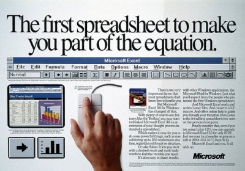
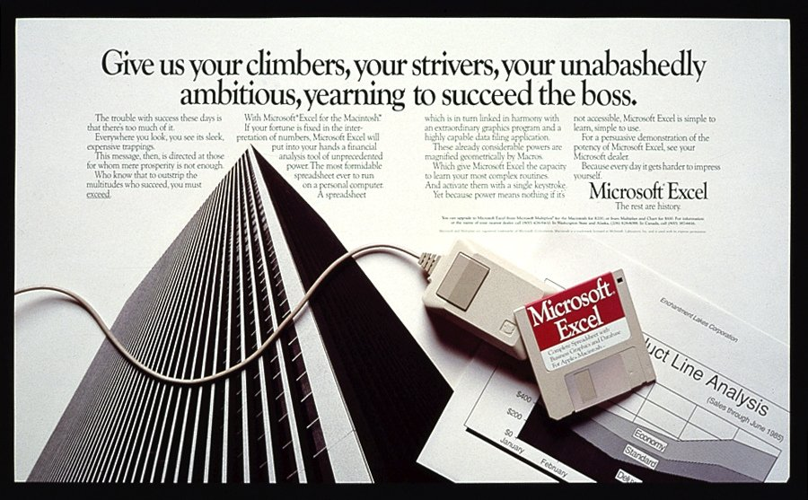

<!-- http://www.businessinsider.com/satya-nadella-excel-is-microsofts-best-consumer-product-2016-6 -->

# Think about a world without Excel. That’s just impossible for me

Over the last four-plus decades, Microsoft has made hundreds of products that touch people’s everyday life, from Windows to Office to the XBox and beyond.

But to CEO Satya Nadella, there’s one product that stands above the rest as the best consumer product that the company has ever made — and a symbol of what the company is all about.

> “Think about a world without Excel. That’s just impossible for me,” Nadella said, speaking at the Aspen Ideas Festival.

Microsoft Excel, the ubiquitous spreadsheet tool first released in 1985 for the Apple Macintosh, took data and number analysis — usually only the domain of a skilled few — and made it accessible to everyone. In so doing, Nadella says, it boosted productivity and kickstarted a new way of thinking about business.

> “People couldn’t make sense of numbers before, and now everybody can,” Nadella says.

In that way, it’s the perfect encapsulation of Microsoft’s mission, Nadella says, which is all about making things to help people be more productive. And while previous CEO Steve Ballmer was business-focused,Nadella is a programmer by training and experience, and he’s trying to get back to those roots of building useful tools.

> “We are a tools company first,” Nadella says.
