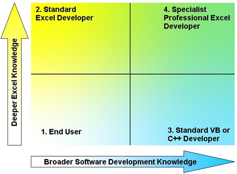

<!-- https://www.codematic.net/excel-development/excel-dev-general/excel-developers.htm -->

# Excel Developers

The Codematic experience of the Excel developer landscape follows. This has mainly been in the UK branches of multinational enterprises, primarily within the financial services sector. Information from on-line communities backs this up, but your mileage may vary.

It seems developers working in the Excel space can be usefully split based on 2 main dimensions - their knowledge of Excel and their knowledge of more general software development. There is a third dimension not considered in the diagram, and that is knowledge of the clients business.

This paper does not set out to judge any one set as better or worse than another, for they all clearly have their place. The graduated colours indicate there is a continuum from one area to another, the boundaries are hazy rather than sharp.

## 1. End Users

Starting in the bottom left quadrant is the end user with relatively limited depth of Excel knowledge and limited breadth of software development principles. This is the person who uses the spreadsheets they develop as part of their main job function. This means most of their developments are for their own use (at least initially - personal spreadsheets have a habit of becoming departmental)
Excel knowledge level goes from:
completely basic – typing numbers calculated elsewhere into the spreadsheet to present them in a certain layout or format 
To: advanced user skills – comfortable with most of those Excel features and functions that are relevant to their primary job role, maybe some basic macro recording.
People from this area are the primary feed for the one above, the ‘Standard’ Excel developer. 
Typical applications would be almost purely worksheet based with perhaps some simple macros on worksheet buttons.

## 2. Standard Excel Developers

The upper left quadrant is the ‘Standard’ Excel developer. This is someone who regularly develops spreadsheets for other people to use, they may also be an end user of some of their work. 
This is someone who has a deeper knowledge of Excel, but still relatively limited knowledge of software development principles and practices. They will be comfortable with most of the advanced features of Excel, such as calculations in pivot tables for example, and advanced functions such as array functions, SUMPRODUCTs etc. They will probably have a good knowledge of the excel object model and write VBA to take advantage of that (such as setting values, not selecting etc). 

Their code can often be difficult for others to maintain as their program design skills are limited and their consistency is weak, they probably do not apply many conventions in their code. Because they work exclusively or mainly in Excel and VBA they do not have access to many tools and techniques from mainstream software development such as Test Driven Development, source control, FxCop etc. Their employing organisation absolutely will not invest in relevant training and/or time saving and quality enhancing tools (some of the higher level individuals do, indeed some of them write the tools and provide training). Unfortunately the organisation is often completely blind to the fact it is developing software, let alone concerned about how to develop high quality spreadsheet software.

Most commercial Excel developers are to a greater or lesser extent in this quadrant. Mainly they come from an end user background and have a primary profession that is not software development, this makes it difficult to move over to the right and broaden their mainstream software development exposure. It does mean however that they generally have good business knowledge and are able to communicate effectively with clients.

Typical applications would be pure Excel/VBA solutions, perhaps including XLA add-ins, generally data would be held within workbooks rather than a database. Code would be VBA rather than VB6, .net or C++ ( or other).

## 3. Standard VB or C++ Developers

To the lower right of the quadrant are the mainstream developers involved in Excel development. These are people whose primary profession is software development and they are working with Excel. Their software design skills are likely to be good, but their knowledge of the Excel object model is poor, often so poor they do not realise how much they do not know. The Excel object model exposes over 200 objects and around 4,500 properties and methods, most VB Activex controls are trivial by comparison. These developers will write Object Oriented VBA but it will include hand written FindCell type functions instead of using Excels own fast and powerful range.find method for example. They will have a poor grasp of the effective combination of worksheet functionality and VBA code, generally preferring VBA even where a worksheet function would be better.

There are relatively few people in this area as many development principles are hard to apply in spreadsheet development (eg. Data encapsulation). Recent graduates will have developed a language preference at college, this is likely to be Java or .net, it is almost certainly not VBA in Excel. Even hardcore VB6.0 developers generally have a preference for anything except Excel. Those in this area tend to migrate back to mainstream development areas rather than deepen their Excel knowledge and move towards the specialist Excel Developer above.

A typical application would be extracting some enterprise database info (from Oracle or SQL Server) into a spreadsheet and formatting it into an attractive report using automation. Probably from a web app if the developer has any say. May also author xll based worksheet functions if from a C/C++ background.

## 4. Specialist Professional Excel Developers

The final quadrant is the top right – the specialist professional Excel developer. These people have a very deep knowledge of Excel and its interaction with other products. They also have a broad knowledge of mainstream development at a useful depth. These developers write powerful efficient code in the most appropriate language to take full advantage of Excels features and functions to write maintainable extensible applications involving Excel somewhere.That’s the important bit: ‘involving Excel somewhere’, their broad industry knowledge means they can combine Excel with other products that provide functionality Excel lacks.

Their software design skills are good, and their application architecture skills are good, As they seem to tend to come from an end user background they generally have good empathy with the customer. They often develop within the area they used to be an end user in so they have good business analysis skills, and are able to develop usable requirements effectively. They are likely to have been around for a while, and will have access to well written, easy to adapt, reusable library code from other live projects. They will desire to use professional quality tools and processes, which are hard to find in many organisations sponsoring Excel developments. This explains the high incidence of self employment, and the frequent eventual migration out of Excel development into mainstream technologies.

Typically these developers work on a broad range of projects, perhaps migrating pure spreadsheet applications to a database architecture, or creating dynamic analysis tools for OLAP data sources such as Analysis Services or Essbase. They will be more likely to have OLAP experience than relational (OLTP) as Excel use is heavily weighted towards reporting rather than transaction processing. They may also author xll based worksheet functions and COM add-ins. A key feature of their systems is Excel will be the presentation/user analysis layer only, with other components working together in the background, doing everything else.

Whilst their breadth and depth of knowledge may not be required for some projects, they are the only people with enough information to make that judgement in many cases. These developers can often provide an initial architecture and then mentor less experienced developers through the actual coding.

Specialist Professional Excel Developers may be out of reach of many organisations either because the organisation is too immature in its development processes and practices to attract or keep high quality developers, or because their recruitment guidelines rigidly ignore the proven evidence of the excellent value for money quality developers represent. To have a rigid rate per day, with no consideration of what a developer day actually represents in terms of project progress is just poor management. With rates in mainstream development generally better than Excel related work, changing focus can be easy for these developers to rationalise.

Rates:

Very approximate UK contracting day rates for people in each category in late 2006 (based on Jobserve data), bear in mind that significant business knowledge could vary the rates by over 100% (eg good knowledge of Bloomberg and Reuters trading data feeds could increase rates by 150%). These are based on a 3/6 month contract, single day rates would be significantly more, where available.

Excel End User	Depends on primary job role rates
Standard Excel Developer	150-300 GBP
Standard VB/C++ Developer	150-400 GBP
Specialist Professional Excel Developer	300-600 GBP

Recruitment

So those are the options, once you have decided what sort of developer your project requires, the next issue is how to recruit potential candidates.

A word of caution here - the spreadsheet world and the software development world are rife with over confidence. Anyone who considers themselves to be a guru is more likely to be unaware of how much they don't know than an actual guru.

When we consider candidates (both independently for clients or for our own projects) we review real world work examples, we look for quality on the spreadsheet side as described in these slides,and we look for quality on the VBA side as described in these slides. We establish breadth of knowledge by discussing the work examples. Codematic itself deals exclusively with contacts from the on-line communities based on public reputation, that works well at the more experienced end, probably not so relevant for people with less experience.